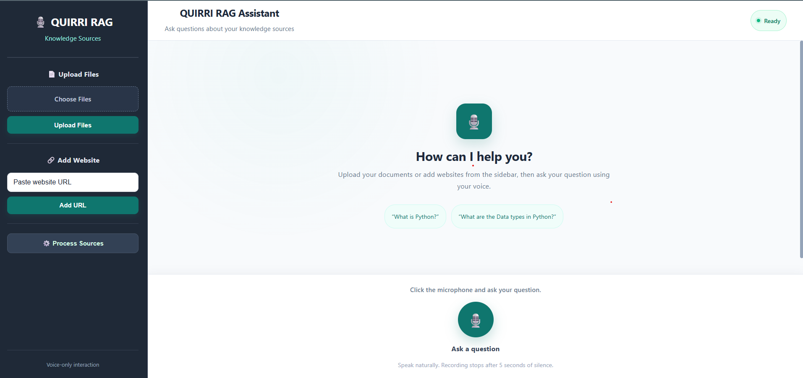
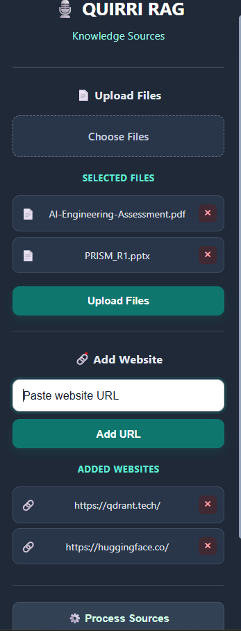
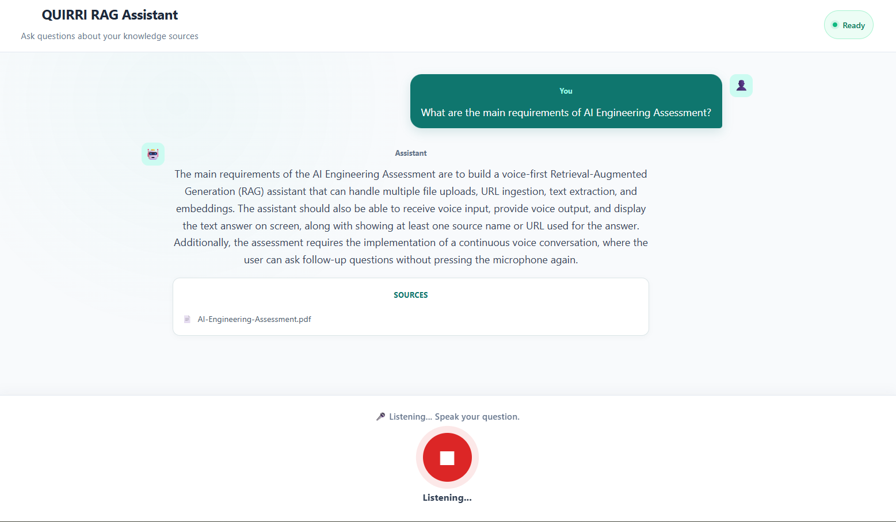
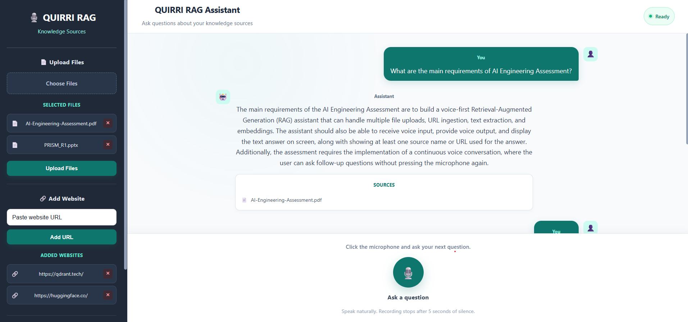

# 🎙️ QUIRRI RAG Assistant

A voice-based **Retrieval-Augmented Generation (RAG)** application that
allows users to ask questions using their **voice** and receive
AI-generated answers grounded in uploaded documents and scraped website
content.

The application combines **Speech-to-Text (STT)**, document processing,
web scraping, embeddings, **Qdrant vector search**, LLM-based answer
generation, and **Text-to-Speech (TTS)** into an end-to-end
conversational AI system.

------------------------------------------------------------------------

## 📌 Project Overview

Traditional RAG applications usually require users to type their
questions.

This project provides a natural **voice-first interface** where users
can:

-   Upload documents as knowledge sources
-   Add website URLs for web-content ingestion
-   Ask questions **only through voice**
-   Retrieve relevant information using vector similarity search
-   Receive an AI-generated answer
-   Listen to the answer through text-to-speech
-   Continue the conversation naturally


### 🚀 Application Preview

<p align="center">
  
</p>

<p align="center">
  <em>Voice-first RAG assistant with document/URL knowledge sources and conversational voice interaction.</em>
</p>

### Overall Flow

``` text
User speaks a question
        ↓
Speech-to-Text
        ↓
Recognized Question
        ↓
Question Embedding
        ↓
Qdrant Vector Search
        ↓
Relevant Document Chunks
        ↓
LLM / RAG
        ↓
Generated Answer
        ↓
Text-to-Speech
        ↓
Voice Response
```

------------------------------------------------------------------------

## ✨ Features

### 🎙️ Voice-Only Question Input

Users ask questions using the microphone.

The frontend does **not provide a typed question input**. Voice is the
only method for entering questions.

Example:

``` text
User:
"Who is Subramanian?"

        ↓

Speech-to-Text

        ↓

"Who is Subramanian?"

        ↓

RAG + LLM

        ↓

Generated Answer

        ↓

Voice Response
```

### ⏱️ Automatic Silence Detection

The user can speak for any required duration.

Recording automatically stops when approximately **5 seconds of
silence** is detected.

``` text
Start Recording
      ↓
User Speaks
      ↓
Continuous Recording
      ↓
5 Seconds of Silence
      ↓
Recording Stops
      ↓
Audio Sent to Backend
```

A manual stop option is also available.

### 🗣️ Backend Speech-to-Text

The browser captures microphone audio while the backend handles speech
recognition.

This provides a controlled backend STT pipeline instead of relying on
the browser's Web Speech API.

### 🔊 Text-to-Speech

The generated answer is converted into speech using **Microsoft Edge
TTS**.

Current default voice:

``` text
en-US-GuyNeural
```

When the user starts asking the next question, any currently playing TTS
response is automatically stopped.

------------------------------------------------------------------------

## 📄 Document Upload

Users can upload multiple knowledge-source files through the sidebar.

Supported formats currently include:

-   PDF
-   TXT
-   PowerPoint (`.pptx`)
-   Other text-based content supported by the backend

Example:

``` text
resume.pdf
text.txt
project_document.pdf
presentation.pptx
```

------------------------------------------------------------------------

## 🌐 Website URL Scraping

Users can also add websites as knowledge sources.

Example:

``` text
https://example.com
```

The backend:

``` text
Website URL
     ↓
Web Scraping
     ↓
Content Extraction
     ↓
Text Processing
     ↓
Chunking
     ↓
Embeddings
     ↓
Qdrant
```

The URL remains visible in the input field until it is successfully
processed or edited by the user.

------------------------------------------------------------------------

## 🚫 Duplicate Source Prevention

The application prevents duplicate knowledge sources.

### Duplicate Files

If a file has already been added, uploading the same file again does not
create another source.

### Duplicate URLs

If the same URL is added again, the application prevents it from being
added twice.

This avoids unnecessary processing and duplicate embeddings.

------------------------------------------------------------------------

# 🧠 Retrieval-Augmented Generation

The core of the application is a **RAG pipeline**.

Instead of relying only on the LLM's internal knowledge, the system
first retrieves relevant information from the application's knowledge
base.

``` text
Documents / URLs
       ↓
Content Extraction
       ↓
Text Cleaning
       ↓
Chunking
       ↓
Embeddings
       ↓
Qdrant
       ↓
Vector Similarity Search
       ↓
Relevant Chunks
       ↓
LLM
       ↓
Final Answer
```

This allows the assistant to generate answers based on the user's own
documents and website sources.

------------------------------------------------------------------------

## 🗄️ Qdrant Vector Database

The project uses **Qdrant** as its vector database.

Collection:

``` text
voice_rag_documents
```

Knowledge-source chunks are converted into embeddings and stored in this
collection.

During question answering:

``` text
Voice Question
      ↓
Speech-to-Text
      ↓
Question Embedding
      ↓
Qdrant Similarity Search
      ↓
Relevant Chunks
      ↓
LLM
      ↓
Answer
```

A development utility is also included:

``` text
backend/app/delete_qdrant_vector.py
```

It can be used to clear vectors when starting a fresh development/test
dataset.

------------------------------------------------------------------------

## 🔢 Embeddings

Text chunks are converted into numerical vector representations called
**embeddings**.

Embeddings allow the application to compare the semantic similarity
between:

``` text
User Question
      ↕
Document / Website Chunks
```

The most relevant chunks are retrieved from Qdrant and provided to the
LLM as context.

------------------------------------------------------------------------

## 🤖 LLM Answer Generation

After retrieving relevant context from Qdrant, the application sends the
question and retrieved information to the configured LLM.

The LLM generates a natural-language answer based on the retrieved
context.

LLM implementation:

``` text
backend/app/llm.py
```

------------------------------------------------------------------------

## 💬 Conversational Interaction

The frontend maintains conversation history in the chat interface.

Example:

``` text
You:
Who is Subramanian?

Assistant:
Subramanian is ...


You:
What projects has he worked on?

Assistant:
He has worked on ...


You:
Which technology was used for the RAG project?

Assistant:
The project uses ...
```

This allows the application to behave like a conversational assistant
rather than a collection of independent questions.

------------------------------------------------------------------------

# 🎨 User Interface

The frontend is developed using **React + Vite**.

The interface contains three main areas.

### Sidebar

-   File upload
-   Website URL input
-   Uploaded source list
-   Remove source option
-   Process Sources button
-   Source status messages

### Main Chat Area

-   Conversation history
-   User questions
-   Assistant answers
-   Retrieved source information

### Voice Area

-   Microphone button
-   Recording status
-   Voice processing status
-   Silence detection status

------------------------------------------------------------------------

# 📸 Application Screenshots

### 🏠 1. Application Home Screen


```text
screenshots/home.png
```

<p align="center">
  
</p>

The screenshot should ideally show the overall interface, including the source sidebar, chat area, and microphone/voice section.

---

### 📄 2. Document Upload and 🌐 URL Scraping

Show the application with one or more documents ane URLs added.

```text
screenshots/file-upload.png
```

<p align="center">
  
</p>

This demonstrates that the application can use uploaded documents and url scraped text as RAG knowledge sources.

---

### 🎤 4. Voice Interaction

Show the microphone/recording state while the user is asking a question.

```text
screenshots/voice-recording.png
```

<p align="center">
  
</p>

This screenshot is especially important because the project is designed around **voice-only question input**.

---

### 💬 5. Final Conversational Output

Show a completed interaction where the user's spoken question has been converted to text and the assistant has generated an answer.

```text
screenshots/conversation.png
```

<p align="center">
  
</p>

# 🏗️ System Architecture

``` text
                         ┌──────────────────────┐
                         │        User          │
                         │                      │
                         │   Speaks Question    │
                         └──────────┬───────────┘
                                    │
                                    ▼
                         ┌──────────────────────┐
                         │    React + Vite      │
                         │      Frontend        │
                         └──────────┬───────────┘
                                    │
                              Audio / API
                                    │
                                    ▼
                         ┌──────────────────────┐
                         │    FastAPI Backend   │
                         └──────────┬───────────┘
                                    │
                                    ▼
                         ┌──────────────────────┐
                         │   Speech-to-Text     │
                         └──────────┬───────────┘
                                    │
                              Recognized Text
                                    │
                                    ▼
                         ┌──────────────────────┐
                         │ Embedding Pipeline   │
                         └──────────┬───────────┘
                                    │
                                    ▼
                         ┌──────────────────────┐
                         │   Qdrant Vector DB   │
                         │                      │
                         │ voice_rag_documents  │
                         └──────────┬───────────┘
                                    │
                             Relevant Chunks
                                    │
                                    ▼
                         ┌──────────────────────┐
                         │         LLM          │
                         │   Answer Generation  │
                         └──────────┬───────────┘
                                    │
                                  Answer
                                    │
                                    ▼
                         ┌──────────────────────┐
                         │      Edge TTS        │
                         │   en-US-GuyNeural    │
                         └──────────┬───────────┘
                                    │
                                    ▼
                              🔊 Voice Response
```

------------------------------------------------------------------------

# 🔄 Complete Application Workflow

## 1. Add Knowledge Sources

The user can:

``` text
Upload Documents
       OR
Add Website URLs
```

## 2. Process Sources

The backend:

``` text
Extract Content
      ↓
Clean Text
      ↓
Split into Chunks
      ↓
Generate Embeddings
      ↓
Store Vectors in Qdrant
```

## 3. Ask a Question

The user clicks the microphone and speaks a question.

Example:

``` text
"Who is Subramanian?"
```

Questions are entered through **voice only**.

## 4. Record Audio

The frontend captures microphone audio.

Recording continues until approximately **5 seconds of silence** are
detected, or the user manually stops recording.

## 5. Speech-to-Text

The recorded audio is sent to the backend.

``` text
Audio
  ↓
Speech-to-Text
  ↓
"Who is Subramanian?"
```

## 6. Retrieve Relevant Information

The recognized question is converted into an embedding.

Qdrant performs a similarity search against the stored knowledge
sources.

``` text
Question
   ↓
Embedding
   ↓
Qdrant Search
   ↓
Relevant Chunks
```

## 7. Generate Answer

The retrieved chunks are provided to the LLM as context.

``` text
Question + Retrieved Context
            ↓
           LLM
            ↓
      Generated Answer
```

## 8. Display Answer

The generated answer is displayed in the conversation interface.

Relevant source information can also be displayed.

## 9. Text-to-Speech

The generated answer is converted into speech.

``` text
Generated Answer
      ↓
   Edge TTS
      ↓
Voice Response
```

## 10. Continue Conversation

When the user starts asking another question, any currently playing TTS
response is automatically stopped.

This enables continuous conversational interaction.

------------------------------------------------------------------------

# 📁 Project Structure

``` text
voice-rag-project/
│
├── backend/
│   ├── app/
│   │   ├── main.py
│   │   ├── processor.py
│   │   ├── chunker.py
│   │   ├── embeddings.py
│   │   ├── extractors.py
│   │   ├── llm.py
│   │   ├── qdrant_db.py
│   │   ├── scraper.py
│   │   ├── sources.py
│   │   ├── speech.py
│   │   ├── tts.py
│   │   └── delete_qdrant_vector.py
│   │
│   ├── test_each_module.py
│   └── requirements.txt
│
├── frontend/
│   ├── src/
│   │   ├── App.jsx
│   │   ├── App.css
│   │   └── ...
│   │
│   ├── package.json
│   └── ...
│
├── screenshots/
│   ├── home.png
│   ├── file-url-upload.png
│   ├── voice-recording.png
│   └── conversation.png
│    
├── .gitignore
└── README.md
```

------------------------------------------------------------------------

# 🛠️ Technology Stack

### Frontend

-   React
-   Vite
-   JavaScript
-   CSS
-   Web Audio APIs
-   Browser microphone access

### Backend

-   Python
-   FastAPI
-   Uvicorn

### AI / LLM

-   Google Gemini API
-   Groq API where configured

### RAG / Vector Database

-   Qdrant
-   Embeddings
-   LangChain text splitters

### Document Processing

-   PyMuPDF
-   python-pptx

### Web Scraping

-   Requests
-   BeautifulSoup
-   lxml

### Speech

-   Backend Speech-to-Text pipeline
-   Microsoft Edge TTS

### Environment Management

-   python-dotenv

------------------------------------------------------------------------

# ⚙️ Installation

## Prerequisites

Install the following:

-   Python 3.11+
-   Node.js
-   npm
-   Git
-   Qdrant account/instance
-   Required AI API credentials

------------------------------------------------------------------------

# 🐍 Backend Setup

Navigate to the backend:

``` bash
cd backend
```

Create a virtual environment:

### Windows

``` bash
python -m venv venv
```

Activate it:

``` bash
venv\Scripts\activate
```

Install dependencies:

``` bash
pip install -r requirements.txt
```

------------------------------------------------------------------------

# 🔐 Environment Variables

Create a `.env` file inside the `backend` directory.

Example:

``` env
QDRANT_URL=your_qdrant_url
QDRANT_API_KEY=your_qdrant_api_key

GEMINI_API_KEY=your_gemini_api_key

GROQ_API_KEY=your_groq_api_key
```

Use only the variables required by your current configuration.

### ⚠️ Security

Never commit `.env` or API credentials to GitHub.

``` text
.env
API keys
Passwords
Private credentials
```

should remain local.

------------------------------------------------------------------------

# ▶️ Run Backend

From the `backend` directory:

``` bash
uvicorn app.main:app --reload
```

Backend:

``` text
http://127.0.0.1:8000
```

FastAPI documentation:

``` text
http://127.0.0.1:8000/docs
```

------------------------------------------------------------------------

# ⚛️ Frontend Setup

Open another terminal.

Navigate to:

``` bash
cd frontend
```

Install dependencies:

``` bash
npm install
```

------------------------------------------------------------------------

# ▶️ Run Frontend

Start the Vite development server:

``` bash
npm run dev
```

Vite will provide the local frontend URL, typically:

``` text
http://localhost:5173
```

Open the URL in your browser.

------------------------------------------------------------------------

# 🎤 Using the Application

### Step 1 --- Start Backend

``` bash
uvicorn app.main:app --reload
```

### Step 2 --- Start Frontend

``` bash
npm run dev
```

### Step 3 --- Add Documents

Use the file-upload section to select one or more documents.

### Step 4 --- Add Website

Paste a URL into the website URL field and add it as a source.

Example:

``` text
https://example.com
```

### Step 5 --- Process Sources

Click:

``` text
Process Sources
```

The backend extracts the content, creates chunks and embeddings, and
stores them in Qdrant.

### Step 6 --- Ask a Question

Click the microphone and speak naturally.

Example:

``` text
"Who is Subramanian?"
```

The recording automatically stops after approximately 5 seconds of
silence.

### Step 7 --- Receive the Answer

The system performs:

``` text
Voice
  ↓
STT
  ↓
RAG
  ↓
LLM
  ↓
TTS
  ↓
Voice Answer
```

The generated answer is also displayed in the conversation history.

------------------------------------------------------------------------

# 🧪 Development Utility

The project includes:

``` text
backend/app/delete_qdrant_vector.py
```

This utility can be used during development to remove vectors from:

``` text
voice_rag_documents
```

Use it carefully because deleting vectors removes the stored knowledge
from the Qdrant collection.

------------------------------------------------------------------------

# 🔒 Security

API keys and credentials should never be hardcoded in source files.

Use environment variables:

``` env
QDRANT_API_KEY=...
GEMINI_API_KEY=...
GROQ_API_KEY=...
```

Keep `.env` local and ensure it is included in `.gitignore`.

------------------------------------------------------------------------

# 🚧 Current Limitations

The application is currently designed primarily for local development.

The final answer quality depends on:

-   Quality of uploaded content
-   Quality of extracted text
-   Chunking strategy
-   Embedding quality
-   Vector retrieval quality
-   LLM response quality
-   Speech recognition accuracy

Voice recognition can also be affected by:

-   Microphone quality
-   Background noise
-   Pronunciation
-   Internet connection
-   Speech-to-text service performance

------------------------------------------------------------------------

# 🔮 Future Improvements

Possible future enhancements include:

-   User authentication
-   Persistent conversation storage
-   Chat session management
-   More document formats
-   Better document metadata
-   Improved citation handling
-   Streaming LLM responses
-   Streaming TTS
-   Improved voice activity detection
-   Multilingual speech recognition
-   Multilingual TTS
-   Better retrieval and reranking
-   Conversation memory
-   Document management dashboard
-   Source preview
-   Advanced RAG evaluation
-   Cloud deployment

------------------------------------------------------------------------

# 📊 RAG Pipeline Summary

``` text
                  KNOWLEDGE INGESTION

       ┌──────────────┐        ┌──────────────┐
       │  Documents   │        │     URLs     │
       └──────┬───────┘        └──────┬───────┘
              │                       │
              ▼                       ▼
        Text Extraction          Web Scraping
              │                       │
              └───────────┬───────────┘
                          │
                          ▼
                   Text Processing
                          │
                          ▼
                       Chunking
                          │
                          ▼
                      Embeddings
                          │
                          ▼
                ┌───────────────────┐
                │      Qdrant       │
                │ voice_rag_documents│
                └─────────┬─────────┘
                          │
                          │
                  QUESTION ANSWERING
                          │
                          ▼
                   Voice Question
                          │
                          ▼
                   Speech-to-Text
                          │
                          ▼
                  Question Embedding
                          │
                          ▼
                 Qdrant Similarity
                       Search
                          │
                          ▼
                  Relevant Context
                          │
                          ▼
                         LLM
                          │
                          ▼
                   Generated Answer
                          │
                    ┌─────┴─────┐
                    │           │
                    ▼           ▼
                  Chat UI    Edge TTS
                                │
                                ▼
                         Voice Response
```

------------------------------------------------------------------------

# 🎯 Project Objective

The main objective of this project is to build a **voice-driven
knowledge assistant** that can understand questions spoken by users and
provide answers grounded in user-provided documents and web content.

The project demonstrates the integration of:

``` text
Speech Recognition
       +
Web Scraping
       +
RAG
       +
Embeddings
       +
Vector Database
       +
LLM
       +
Text-to-Speech
       +
Conversational UI
```

into a complete end-to-end AI application.

------------------------------------------------------------------------

# 👨‍💻 Author

**Subramanian T**

MCA \| AI / LLM / Python Developer

GitHub:

https://github.com/Subramanian2002
